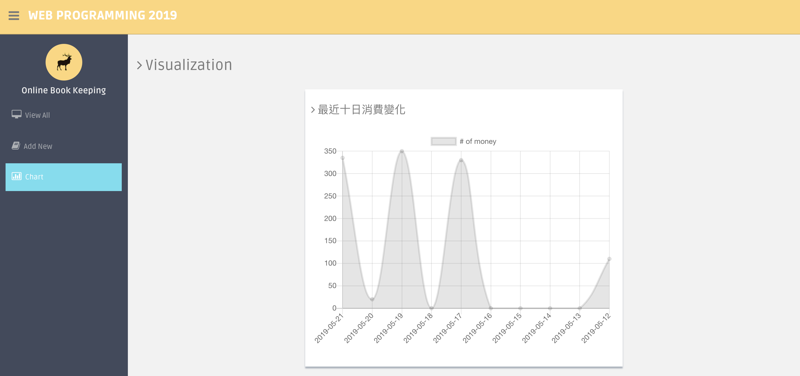
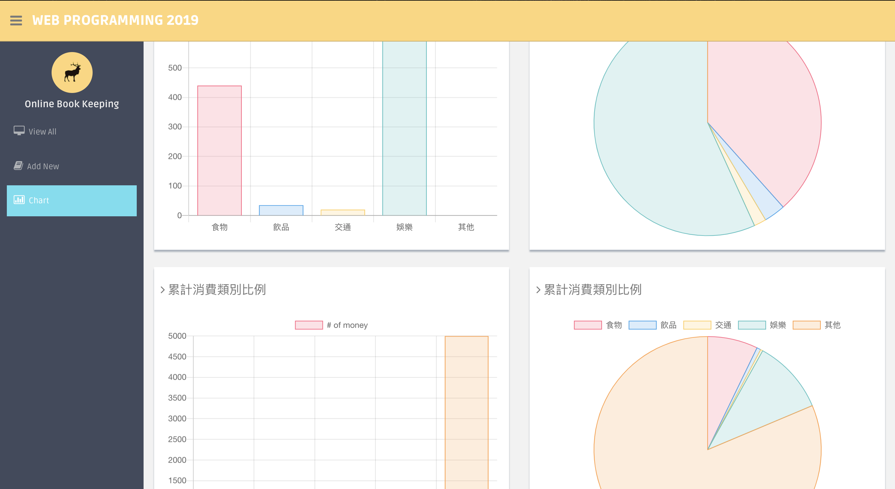

# Online Bookkeeping

Midterm work of Web Programming 2019

### Github Link 

<https://github.com/BaiiYuan/midterm_OnlineBookkeeping>

### 簡介

簡單的記帳網站，可以加入、刪除紀錄，並視覺化顯示圖表

##### 預覽圖：

### 操作方式

1. `git clone https://github.com/BaiiYuan/midterm_OnlineBookkeeping`
2. `cd midterm_OnlineBookkeeping/online_bookkeeping`
3. `npm install`
5. `node server.js`
6. Open another terminal and do `npm start`
7. Go to  http://localhost://3000

### 功能

1. 可以檢視所有記錄的結果
2. 可以刪除紀錄
3. 根據類別、時間來加入一筆記帳
4. 視覺畫圖表，包含過去十天的消費金額變化、消費類別在各時期的比例
5. 就算不用來記帳，看起來也很舒服(x)

### 使用到的框架

- Frontend
  - react.js
  - bootstrap
- Backend
  - express.js
  - node.js
  - Mongodb as database

### 參考

- Frontend
  - Css and Componet -- <https://www.free-css.com/free-css-templates/page192/dashgum>
  - Chart.Js - <https://www.chartjs.org/docs/latest/>
- Backend:
  - rics_chat_boilerplate
  - <https://codeforgeek.com/mongodb-atlas-node-js/>
- Connection between Frontend and Backend
  - <https://github.com/honey93/OrderKitchen>

### 貢獻

* Use React.Js to construct the frontend
* Use Chart.Js to draw lots of charts
* Construct the backend server

### 心得

